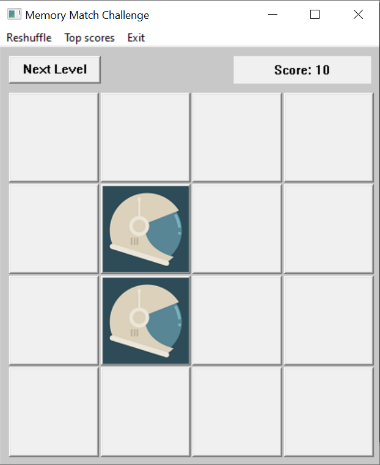

# Memory Match Challenge

Memory Match Challenge is a simple memory game where the player matches pairs of cards. This project demonstrates the use of the Win32 API for creating graphical applications and dynamic linking of game logic.

## Overview

The game allows players to match pairs of cards in a grid layout. It keeps track of scores and supports dynamic loading of high scores from a DLL file. The application is built using C++ and the Win32 API.

## How to Play
1. Launch the game by running `MemoryMatch.exe`.
2. Click on the cards to reveal them.
3. Match pairs of cards to earn points.
4. Complete the level by matching all pairs.
5. View high scores or reset the game from the menu.

## Features
- Dynamic loading of high scores via a DLL.
- Adjustable grid size for increasing difficulty.
- High score saving and retrieval.
- Reshuffling and restarting the game.

## Project Structure

```plaintext
RotaienkoO/
├── Project/                 # Source code of the main game
├── ProjectDDL/              # Source code of the DLL for high scores
├── game.PNG                 # Screenshot of the game
├── GameLogic.dll            # Compiled DLL for high scores
├── MemoryMatch.exe          # Compiled executable of the game
├── README.md                # Documentation
├── scores.txt               # High scores storage file
```

## Setup and Compilation

### Steps
1. Clone the repository or download the project.
2. Navigate to the `Project` folder to compile the main game:
   ```bash
   g++ -o MemoryMatch.exe main.cpp -lgdi32
   ```
3. Navigate to the `ProjectDDL` folder to compile the DLL:
   ```bash
   g++ -shared -o GameLogic.dll GameLogic.cpp
   ```
4. Ensure the compiled `GameLogic.dll` in the same directory as `MemoryMatch.exe`.
5. Run the game by double-clicking `MemoryMatch.exe`.

## Screenshot

Below is a screenshot of the game in action:



